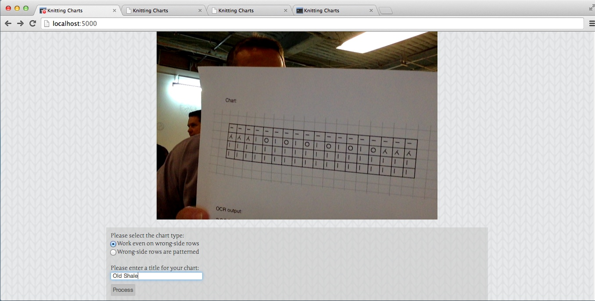
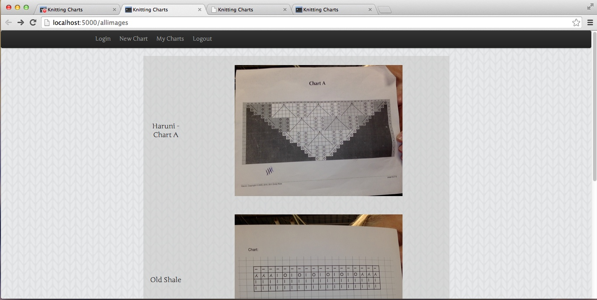
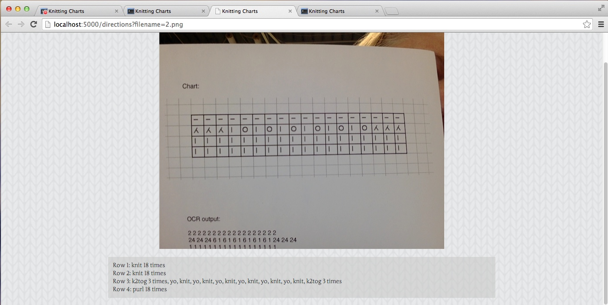

Transforming Knitting Charts
=======

Knitting charts are a visual representation of a knitting pattern, but many people are intimitdated by the need to learn a whole new, symbolic language in order to read them.  My project allows the user to take a photo of a knitting chart and transform it into written directions.  Uses Python, Flask, JavaScript, SQLAlchemy, Jinga, and HTML5 Canvas.

###Knitting Charts
Each square of a knitting chart represents one stitch.  The chart is read from bottom to top.  If the chart is for a pattern that only has patterned stitches on one side of the knitting, it is likely that only the rows with patterning are shown.  Each row is then read from right to left.  If the chart is for a pattern with patterned stitches on both sides of the knitting, right-side rows are read from right to left and wrong-side rows are read from left to right.

###User Interface
After the user logs in, they can use their computer's camera to take a photo of a knitting chart.  The resulting snapshot is paintedt to the HTML5 Canvas so the user can verify the photo is usable.  They can then select the type of chart it is (one-sided or two-sided) and give the chart a name.

Once the image is processed, the user is redirected to a page with the image and the written directions for that image.

The user also has access to a page showing all their charts, from which they can revisit the directions for each chart.

###Next Steps
The next steps for this project is the OCR engine for interpreting the images into usable information.

###Screenshots

